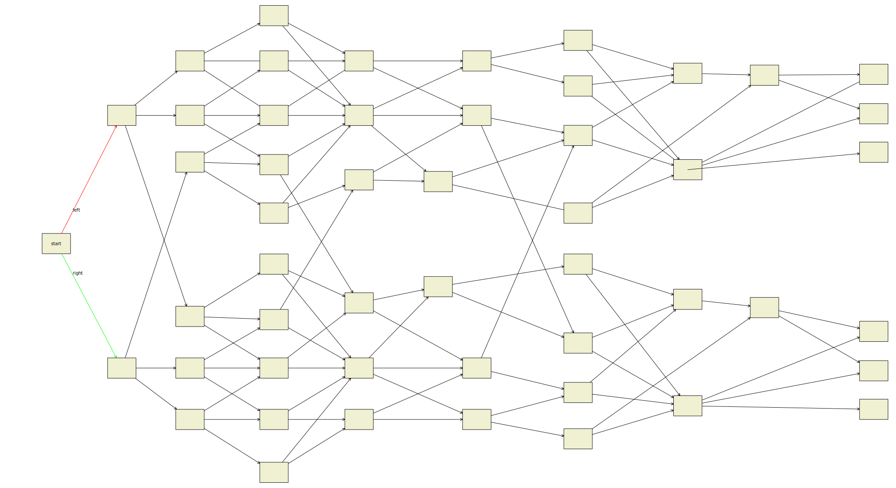

Plotlines
=========

`Plotlines` is a tool to help create online choice-based narratives.

Authors create a basic story structure in [Inkscape](https://inkscape.org/).
Plotlines will read the SVG file and generate templates for HTML5 output.

Works-in-progress can be saved in human-readable [TOML](https://toml.io/en/) format,
suitable for collaboration and iterativce editing.

Use Case
--------



[TOML](https://toml.io/en/)
[Dunnart](https://github.com/mjwybrow/dunnart)
[Inkscape](https://inkscape.org/)
[Spiki](https://pypi.org/project/spiki/)

Features
--------

Mode of use                                     | CLI options               |   Progress        |   Status
------------------------------------------------|---------------------------|-------------------|-------
Auto-generation of plot structures              | Omit `-i` option          |   Ongoing         | :x:
Convert Dunnart files to TOML format            | `-i <file>.svg -o .toml`  |   Complete        | :ok:
Convert Inkscape files to TOML format           | `-i <file>.svg -o .toml`  |   Complete        | :ok:
Load and plot a file in TOML format             | `-i <file>.toml`          |   Complete        | :ok:
Load file and generate a Spiki template tree    | `-i <file>.toml -o <dir>` |   Complete        | :ok:


Usage
-----

```
python3 -m plotlines.main --help
usage: python -m plotlines.main [-h] [--debug] [-i INPUT] [-o OUTPUT] [--ending ENDING] [--limit LIMIT] [--exits EXITS]

options:
  -h, --help            show this help message and exit
  --debug               Display debug information
  -i, --input INPUT     Specify an input file
  -o, --output OUTPUT   Specify an output file or directory
  --ending ENDING       Set the number of endings [4].
  --limit LIMIT         Limit the number of Nodes and Edges in the graph [100]
  --exits EXITS         Fix the number of exiting Edges from each Node [4]
```
